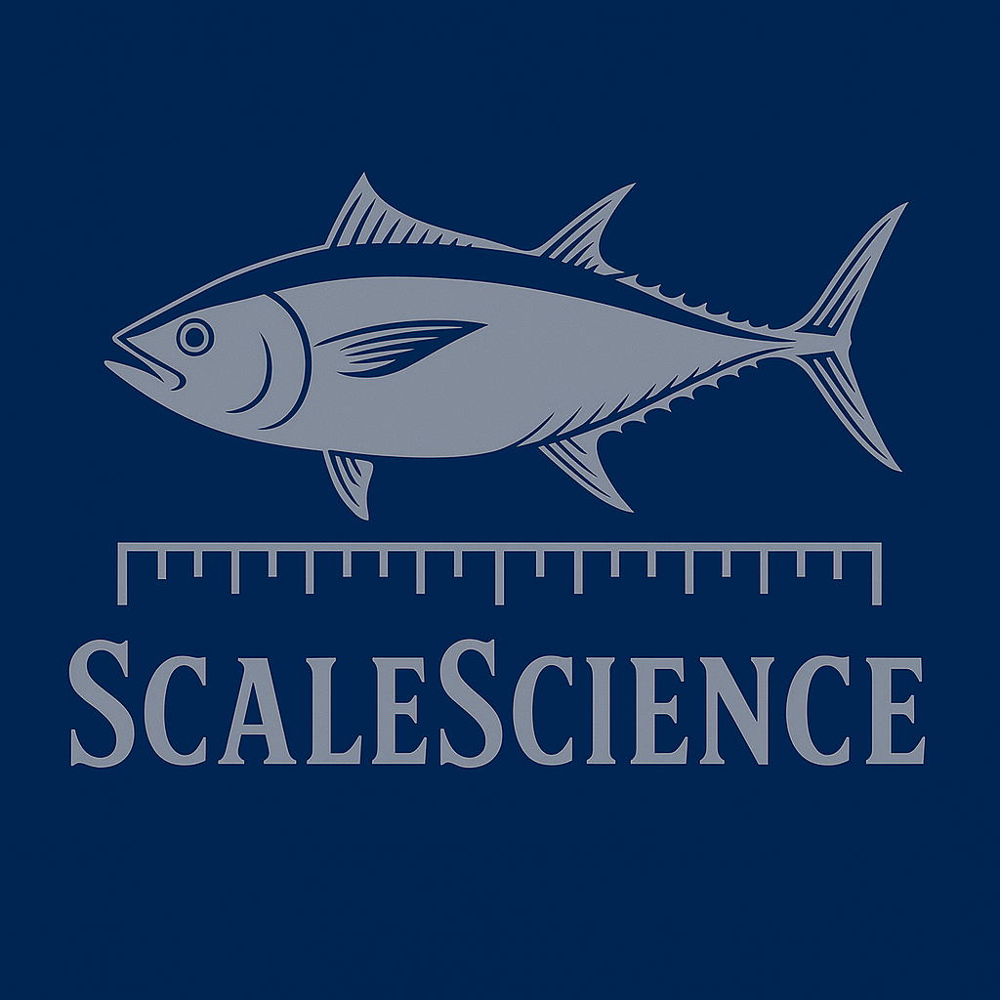

  

### Info  
[ScaleScience Website](https://www.scalescience.us.kg)  
[IOS App](https://apps.apple.com/us/app/scalescience/id6754184953)  
[MacOS App](https://apps.apple.com/us/app/scalescience/id6754184953)  
[GitHub](https://github.com/ScaleScience/ScaleScience)  
[GitHub Issues](https://github.com/ScaleScience/ScaleScience/issues)  
[Privacy Policy](https://www.scalescience.us.kg/?page=privacy)  

#### Contact US  
[Email](scalesciences@gmail.com)   

---

# About ScaleScience  

---

## Our Goals  

---

## Application (IOS, MacOS, WatchOS)

### IOS

### MacOS

### WatchOS - Simplified version of calculator

### Future Updates
[Version Map](future_versions.md)

---

## The WebApp  

---

## Working on analysis of publicly available fisheries data (ICCAT)  

---

## References

### ICCAT Resources

- **ICCAT Website**: https://www.iccat.int/
- **Stock Assessments**: https://www.iccat.int/en/assess.html
- **Data & Statistics**: https://www.iccat.int/en/accesingdb.html
- **Recommendations**: https://www.iccat.int/en/RecRes.html

### National Fisheries Management

- **NOAA Fisheries (USA)**: https://www.fisheries.noaa.gov/species/atlantic-bluefin-tuna
- **EU Fisheries**: https://oceans-and-fisheries.ec.europa.eu/
- **Japan Fisheries Agency**: https://www.jfa.maff.go.jp/e/

### Scientific Organizations

- **ISSF** (International Seafood Sustainability Foundation): https://www.iss-foundation.org/
- **FAO Fisheries**: https://www.fao.org/fishery/
- **FishBase**: https://www.fishbase.org/
- **IGFA** (International Game Fish Association): https://www.igfa.org/